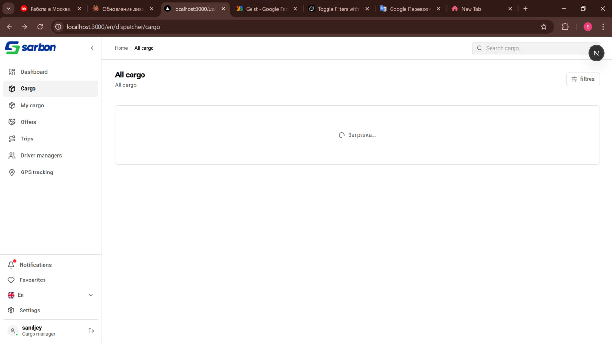
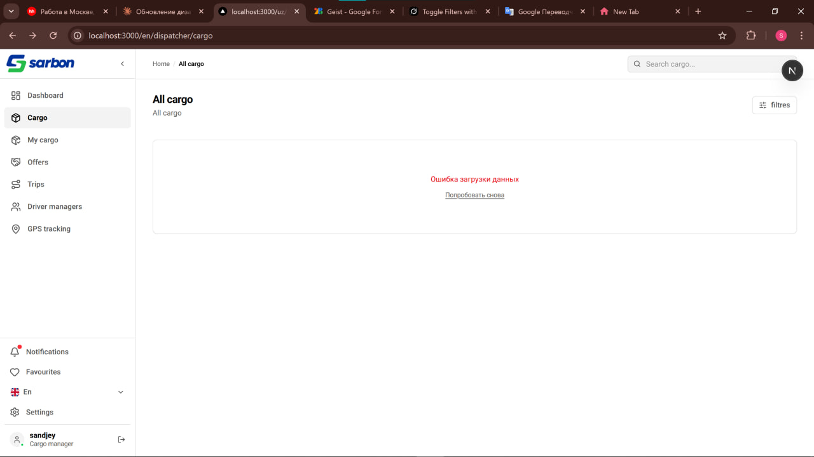
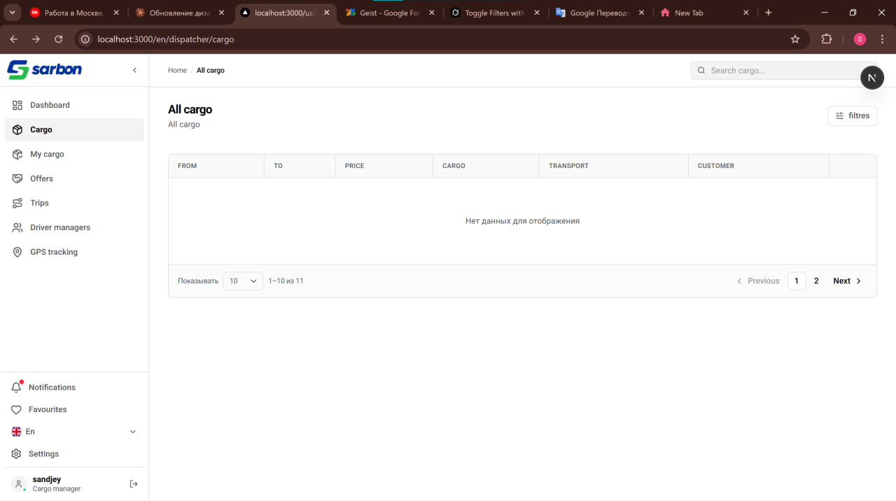
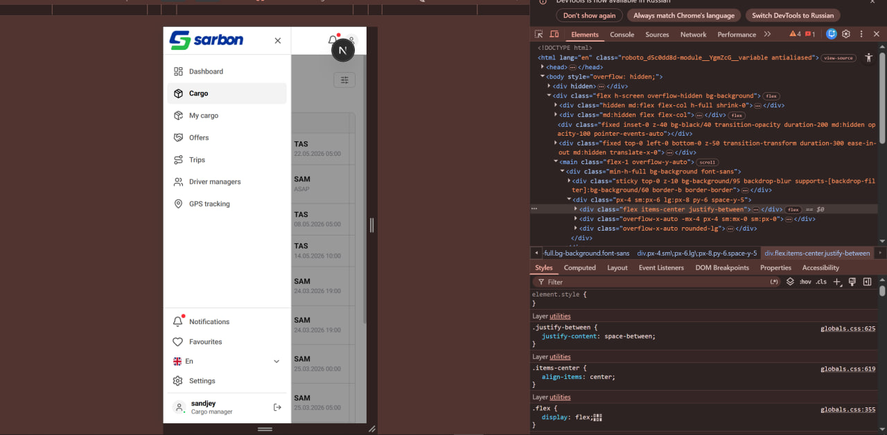

# 🚚 Sarbon App — Панель управления грузами

Современная таблица управления грузами с фильтрацией, пагинацией, поддержкой трёх языков и полной адаптивностью.

---

## 📸 Скриншоты

| Загрузка                   | Ошибка                   |
| -------------------------- | ------------------------ |
|  |  |

| Пустой список           | Адаптив                   |
| ----------------------- | ------------------------- |
|  |  |

> Скриншоты находятся в папке `/public` проекта.

---

## ⚡ Запуск проекта

```bash
# Установить зависимости
pnpm i

# Запустить сервер разработки
pnpm run dev
```

Открыть [http://localhost:3000](http://localhost:3000) в браузере.

---

## ✅ Реализовано

- **Header** — Шапка приложения с логотипом и переключателем языка
- **Filter Panel** — Панель фильтрации по дате, статусу и другим параметрам
- **Cargo Table** — Таблица грузов с сортировкой и всеми данными
- **Pagination** — Пагинация для навигации по большим спискам
- **Loading State** — Скелетон-загрузчик пока данные загружаются
- **Error State** — Экран ошибки с возможностью повторить запрос
- **Empty State** — Экран пустого списка когда нет результатов
- **Переводы** — Полная поддержка трёх языков:
  - 🇺🇿 Узбекский (`uz`)
  - 🇷🇺 Русский (`ru`)
  - 🇬🇧 Английский (`en`)
- **Адаптивность** — Корректное отображение на десктопе, планшете и мобильном

---

## 🛠 Стек технологий

| Категория           | Технология                                                                               |
| ------------------- | ---------------------------------------------------------------------------------------- |
| Фреймворк           | [Next.js 16](https://nextjs.org/)                                                        |
| Язык                | [TypeScript 5](https://www.typescriptlang.org/)                                          |
| Стилизация          | [Tailwind CSS v4](https://tailwindcss.com/)                                              |
| UI-компоненты       | [shadcn/ui](https://ui.shadcn.com/) + [Radix UI](https://www.radix-ui.com/)              |
| Запросы к API       | [TanStack React Query v5](https://tanstack.com/query) + [Axios](https://axios-http.com/) |
| Интернационализация | [next-intl](https://next-intl-docs.vercel.app/)                                          |
| Иконки              | [Lucide React](https://lucide.dev/)                                                      |
| Работа с датами     | [date-fns](https://date-fns.org/) + [React Day Picker](https://react-day-picker.js.org/) |
| Флаги стран         | [react-country-flag](https://www.npmjs.com/package/react-country-flag)                   |

---

## 🌐 Интернационализация

Приложение поддерживает три языка через `next-intl`. Файлы переводов находятся в `/messages/`:

```
messages/
├── uz.json   # Узбекский
├── ru.json   # Русский
└── en.json   # Английский
```

Язык переключается через селектор с флагом в шапке приложения.

---

## 📦 Доступные команды

```bash
pnpm dev      # Запуск сервера разработки
pnpm build    # Сборка для продакшена
pnpm start    # Запуск продакшен-сервера
pnpm lint     # Проверка кода через ESLint
```
